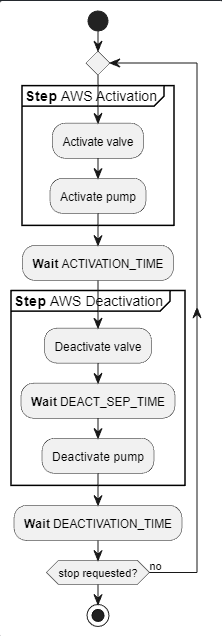

# `auto-watering` command

The command is responsible to activate, deactivate and control the flow of the automatic irrigation of the greenhouse.

## Synopsis

## The automatic watering flow

The flow of the automatic watering system (**AWS**) can be described


```
