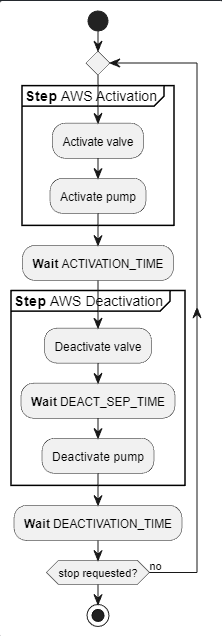

# `auto-watering` command

The command is responsible to activate, deactivate and control the flow of the automatic irrigation of the greenhouse.

## Command description

Please, note that the command uses an **active-low** configuration on all the flow. This was introduced to fix the support for relays. This will properly change in future versions of the application.

### Name

    auto-watering - manages the automatic irrigation of the greenhouse

### Synopsis

        auto-watering [OPTION]...

### Options

```ps
    -h, --help                          Displays this help page.
    -S, --start                         Starts the automatic watering system in Daily-Cycle mode.
    -s, --stop                          Stops the automatic watering system waiting for resources to be released.
    -A, --activation-time arg (=6000)   Sets the automatic watering system activation time (expressed in ms).
    -D, --deactivation-time arg (=600000)
                                        Sets the automatic watering system deactivation time (expressed in ms).
    -P, --pumpvalve-deactsep-time arg (=600)
                                        (CAREFUL) Sets the separation time (espressed in ms) between the pump deactivation and the valve one. WARNING: PLAYING WITH THIS CONFIGURATION MAY LEAD TO HARDWARE FAILURE. USE WITH CAUTION.
    -V, --valve-pin-id arg (=26)        Sets the ID of the pin which will receive the output jumpers that will power up the water valve.
    -U, --pump-pin-id arg (=23)         Sets the ID of the pin which will receive the output jumpers that will power up the water pump.
    -o, --disable-pump                  Disables the pump in the automatic watering system cycles.
    -n, --disable-valve                 Disables the valve in the automatic watering system cycles.
    -E, --enable-pump                   Enables the water pump in the automatic watering system cycles.
    -G, --enable-valve                  Enables the water valve in the automatic watering system cycles.

```

## The automatic watering flow

The flow of the automatic watering system (**AWS**) can be described with the following diagram:



As you can see, during the irrigation deactivation, there is a wait time that is needed to restore the pressure of the water flow so that the pump doesn't get damaged during the process.
